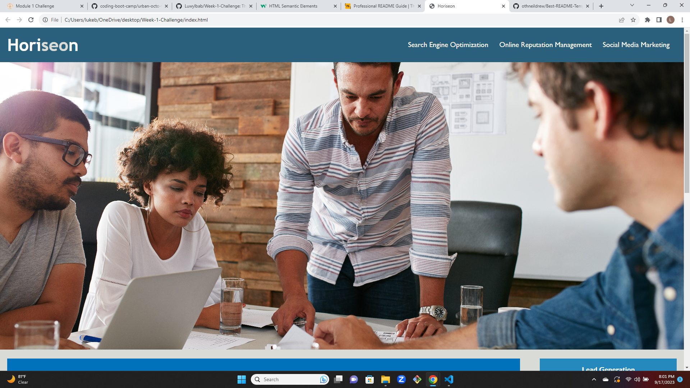
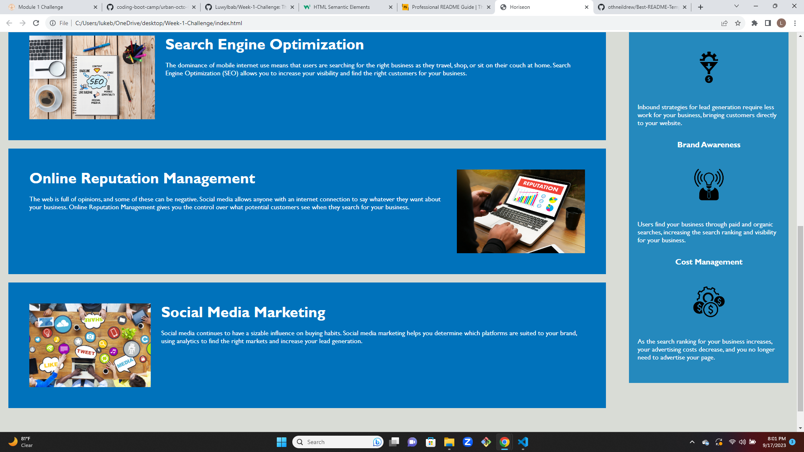

# Module-1-Challenge

## Description

    -I did this project to refactor the code of an existing website, but not change how it works
    
    - My motivation was to make the site more accesible, and optimize it for search engines

    - I condensed the stylehseet to make the code more effecient, I altered the language to change the non-semantic elements into semantic elements, I added accessibility options to the images,
    I reviewed the code to make sure it followed a logical order, and I gave the webpage a more clear and concise title

    - I learned more about the difference between semantic and non-semantic elements, and how to write html and css more efficiently.

## Installation

    - Get SSH key from https://github.com/Luwylbab/Week-1-Challenge

    - Clone the repository using [git clone git@github.com:Luwylbab/Week-1-Challenge.git]

## Usage

    - Use the navigation bar at the top of the webpage, click on a link and it will take you to to a point on the page to where you can read about the desired topic.

 
 

## Credits

https://github.com/coding-boot-camp/urban-octo-telegram

https://stackoverflow.com/questions/10189356/how-to-add-screenshot-to-readmes-in-github-repository

https://coding-boot-camp.github.io/full-stack/github/professional-readme-guide

https://www.w3schools.com/html/html5_semantic_elements.asp
